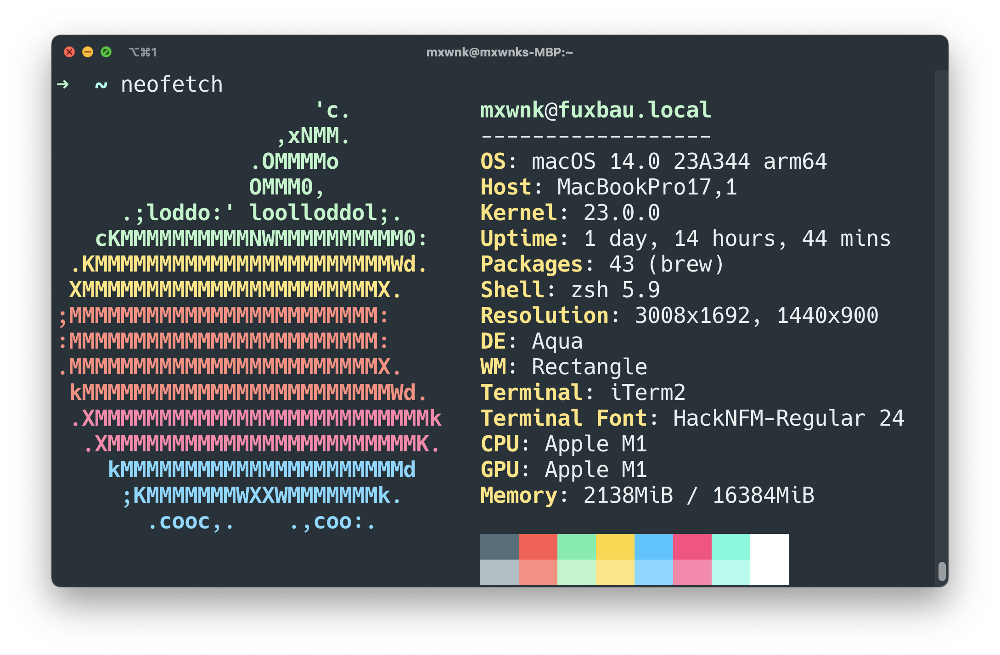

# Setup for macOS

This repository contains my macOS dev machine setup :)

## Tools

* [Brew](https://brew.sh/)
* [nvchad](https://nvchad.com/)
* [Aerospace](https://github.com/nikitabobko/AeroSpace)
* [DevToys](https://github.com/ObuchiYuki/DevToysMac.com/)
* [Rectangle](https://rectangleapp.com/)
* [1Password](https://1password.com/)
* [PDFExpert](https://pdfexpert.com/)
* [Pikka](https://www.pikka.app/)
* [Marta](https://marta.sh/)

## Brew

* `brew bundle install --file ./Brewfile`

## Shell

* [iTerm2](https://iterm2.com/)
* [Zsh](https://formulae.brew.sh/formula/zsh)
* [OhMyZsh] `sh -c "$(curl -fsSL https://raw.githubusercontent.com/ohmyzsh/ohmyzsh/master/tools/install.sh)"`

## General

### Key Settings

See [Key Repeat Tester](https://mac-key-repeat.zaymon.dev/) to test settings:
* PressAndHold for vim in visual studio code: `defaults write NSGlobalDomain "ApplePressAndHoldEnabled" -bool "false"`
* InitialKeyRepeat: `defaults write -g InitialKeyRepeat -int 12`
* KeyRepeat: `defaults write -g KeyRepeat -int 2`
